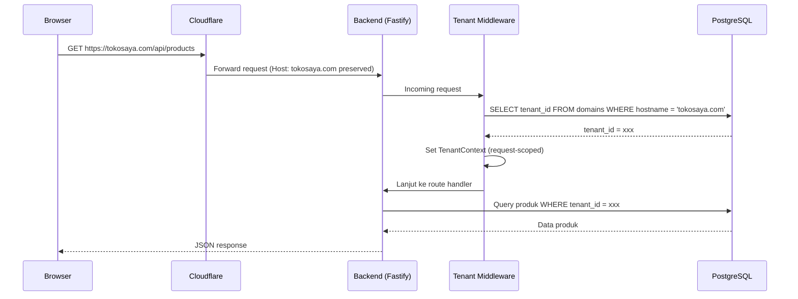
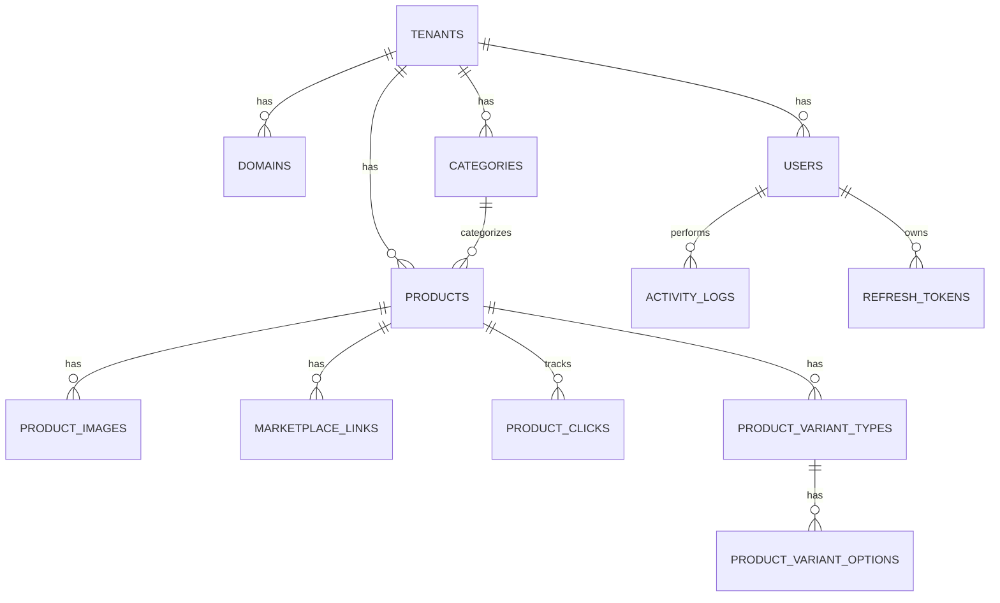

# SaaS Catalog — Backend Planning (MVP)

Status: Draft
Owner: Backend Team
Terakhir diupdate: 2026-07-20

## 1. Overview

Sistem SaaS Catalog terdiri dari 3 komponen:

| Komponen | Deskripsi |
|---|---|
| **BE (Backend API)** | Satu backend melayani semua tenant (multi-tenant, shared deployment). Fokus dokumen ini. |
| **FE Store** | Web katalog publik, dinamis per tenant. List produk, detail produk, link ke marketplace (e-commerce), hanya tampilkan harga dasar. Bisa mewakili banyak store, tapi **di-deploy sebagai satu instance** dan resolve tenant dari domain yang diakses pengunjung. |
| **FE CMS** | Dashboard untuk admin/superadmin: setting store & domain, kelola produk, user management, dll. |

Prinsip inti: **satu deployment, banyak tenant, isolasi logis via `tenant_id`**, bukan satu deployment per tenant. Setiap tenant (toko) punya domain sendiri (custom domain), tapi semua domain mengarah ke origin BE/FE yang sama.

## 2. Architecture Flow

Setiap tenant menambahkan custom domain (mis. `storeA.com`, `ujangTokoB.com`). Domain-domain ini di-DNS-kan (CNAME/A record) ke Cloudflare, lalu Cloudflare proxy ke satu origin server. Selama Cloudflare meneruskan `Host` header asli (default behavior untuk proxied record maupun *Cloudflare for SaaS* custom hostname), BE bisa resolve tenant dari header tersebut tanpa perlu setup terpisah per domain di level infra — **tidak perlu deployment tambahan**, hanya 3 aplikasi (BE, FE CMS, FE Store) seperti biasa.

> **Kenapa `Host` header, bukan `Origin`?** `Origin` hanya dikirim browser pada request CORS/cross-origin (fetch, XHR) dan tidak selalu ada (mis. navigasi langsung, SSR-to-BE call). `Host` header selalu ada di setiap HTTP request dan mencerminkan domain yang benar-benar diakses pengunjung — inilah yang dipakai platform SaaS multi-domain (Shopify, Webflow, dll).

> **Kalau Host header ternyata tidak sampai utuh ke origin?** Ini kasus langka (biasanya cuma terjadi kalau ada reverse proxy tambahan yang kamu kontrol sendiri di depan container BE, mis. Nginx/Traefik, yang salah konfigurasi men-strip/rewrite Host). Solusinya bukan nambah aplikasi baru, cukup salah satu dari: (1) pastikan config reverse proxy meneruskan Host apa adanya (`proxy_set_header Host $host;` di Nginx), atau (2) pakai Cloudflare **Transform Rule** (konfigurasi di edge, bukan aplikasi yang di-deploy) untuk inject header cadangan (mis. `X-Tenant-Host`). BE akan cek urutan prioritas: `X-Tenant-Host` (custom, kalau di-set) → `X-Forwarded-Host` → `Host`, jadi resolusi tenant tetap jalan tanpa mengubah jumlah service yang di-deploy.

## 3. Tech Stack

| Category | Technology |
|---|---|
| Framework | NestJS + Fastify |
| ORM | Drizzle ORM |
| Database | PostgreSQL |
| Authentication | JWT + Passport JWT |
| Authorization | RBAC |
| Validation | class-validator + class-transformer |
| Password Hash | Argon2 |
| Logger | Pino + nestjs-pino |
| API Docs | Swagger |
| Storage | Local Storage (MVP), Amazon S3 (Ready via interface) |
| Migration | drizzle-kit |
| Deployment | Docker Compose |

## 4. Multi-Tenancy Strategy

- **Model**: Shared database, shared schema. Semua tabel tenant-scoped punya kolom `tenant_id` (FK ke `tenants.id`).
- **Domain Resolution**: Middleware paling awal (`TenantMiddleware`) resolve hostname dari request dengan urutan prioritas `X-Tenant-Host` (custom header opsional, di-set via Cloudflare Transform Rule kalau suatu saat dibutuhkan) → `X-Forwarded-Host` (bila ada reverse proxy tambahan di depan Nest) → `Host` (default, cukup untuk kebanyakan kasus karena Cloudflare meneruskan Host asli), lalu lookup ke tabel `domains` dan set `TenantContext` untuk request tersebut.
- **Tenant Context**: disimpan sebagai request-scoped provider (atau `AsyncLocalStorage` bila butuh diakses di luar DI graph, mis. di dalam Drizzle query helper). Berisi minimal `{ tenantId, tenantStatus }`.
- **Unresolved domain**: request dengan `Host` yang tidak match ke tabel `domains` → response `404 Tenant Not Found` (untuk Public Store API) sebelum masuk ke controller.
- **Query Isolation**: buat helper/base repository Drizzle yang **wajib** menerima `tenantId` dan otomatis inject `WHERE tenant_id = ?` di setiap query terhadap tabel tenant-scoped. Hindari raw query tanpa filter tenant.
- **Defense-in-depth (opsional, fase lanjut)**: Postgres Row-Level Security (RLS) sebagai lapisan proteksi tambahan kalau ada bug lupa filter di level aplikasi. Tidak wajib untuk MVP, tapi dicatat sebagai opsi hardening.
- **CMS API (admin/superadmin)**: tenant context untuk request CMS diambil dari JWT claim (`tenantId` milik admin yang login), bukan dari domain — karena CMS diakses lewat domain platform sendiri (mis. `cms.platform.com`), bukan domain tenant.

## 5. Roles & Permission Matrix

| Resource | Public | Admin (scoped ke tenant sendiri) | Superadmin (semua tenant) |
|---|---|---|---|
| Store info & produk (read) | ✅ (via domain tenant) | ✅ | ✅ |
| Produk (CRUD) | ❌ | ✅ (tenant sendiri) | ✅ (semua tenant) |
| Kategori (CRUD) | ❌ | ✅ (tenant sendiri) | ✅ (semua tenant) |
| Store settings & domain | ❌ | ✅ (tenant sendiri) | ✅ (semua tenant) |
| User management (admin) | ❌ | ❌ | ✅ |
| Tenant management (create/suspend) | ❌ | ❌ | ✅ |
| Analytics (klik marketplace) | ❌ | ✅ (tenant sendiri) | ✅ (semua tenant) |
| Activity log | ❌ | ✅ (tenant sendiri) | ✅ (semua tenant) |

## 6. Data Model (ERD Ringkas)

| Table | Kolom penting |
|---|---|
| `tenants` | `id`, `name`, `status` (active/suspended), `created_at` |
| `domains` | `id`, `tenant_id`, `hostname` (unique), `is_primary`, `verified_at` |
| `users` | `id`, `tenant_id` (nullable untuk superadmin), `email`, `password_hash`, `role` (superadmin/admin), `is_active` |
| `refresh_tokens` | `id`, `user_id`, `token_hash`, `expires_at`, `revoked_at` |
| `categories` | `id`, `tenant_id`, `name`, `slug` |
| `products` | `id`, `tenant_id`, `category_id`, `name`, `slug`, `description`, `base_price`, `status` (draft/published/archived) |
| `product_images` | `id`, `product_id`, `url`, `sort_order` |
| `product_variant_types` | `id`, `product_id`, `name` (mis. "Ukuran", "Warna", "Jenis"), `sort_order` |
| `product_variant_options` | `id`, `variant_type_id`, `value` (mis. "S", "M", "L" / "Merah", "Biru"), `sort_order` |
| `marketplace_links` | `id`, `product_id`, `marketplace_name` (Tokopedia/Shopee/dll), `url` |
| `product_clicks` | `id`, `product_id`, `marketplace_link_id`, `tenant_id`, `clicked_at`, `ip_hash`/`user_agent` (opsional, untuk analytics) |
| `activity_logs` | `id`, `tenant_id`, `user_id`, `action`, `entity`, `entity_id`, `metadata` (jsonb), `created_at` |

> **Catatan varian**: varian bersifat deskriptif saja (tag informasi "tersedia dalam ukuran/warna apa"), **tidak** ada kombinasi SKU dengan harga atau stok per varian — harga tetap satu (`base_price`) di level produk. Kalau nanti butuh harga/stok per kombinasi varian (mis. "Merah - L" beda harga), perlu tabel tambahan `product_variant_combinations` di fase berikutnya (bukan MVP).

## 7. API Surface

> Route prefix mengikuti pemisahan folder presentation layer (publik vs CMS) — detail lengkap struktur folder, guard/middleware map, dan alasan pemisahan ada di [`folder-structure.md`](./folder-structure.md).

### 7.1 Public Store API (prefix `/store`, no-auth, tenant resolved via domain)
- `GET /store` — informasi store (nama, kontak, sosial media)
- `GET /store/resolve` — resolve tenant by `Host` header (dipakai FE Store untuk SSR/bootstrap)
- `GET /store/products` — list produk (pagination, filter kategori, search)
- `GET /store/products/:slug` — detail produk (termasuk `variantTypes` + `options`)
- `GET /store/products/:slug/related` — produk terkait
- `POST /store/marketplace/:linkId/redirect` — redirect + catat klik analytics

### 7.2 CMS API (prefix `/cms`, auth: admin, scoped ke tenant dari JWT)
- `POST /cms/auth/login`, `POST /cms/auth/refresh`, `POST /cms/auth/logout`
- `GET/PATCH /cms/profile`, `POST /cms/profile/change-password`
- `GET/POST/PATCH/DELETE /cms/products`, `POST /cms/products/:id/publish`, `POST /cms/products/:id/archive`
- `POST/DELETE /cms/products/:id/images`, `PATCH /cms/products/:id/images/reorder`
- `GET/POST/PATCH/DELETE /cms/products/:id/variant-types`
- `GET/POST/PATCH/DELETE /cms/products/:id/variant-types/:typeId/options`
- `GET/POST/PATCH/DELETE /cms/products/:id/marketplace-links`
- `GET/POST/PATCH/DELETE /cms/categories`
- `GET/PATCH /cms/store-settings`, `PATCH /cms/store-settings/contact`, `PATCH /cms/store-settings/social`
- `GET/POST /cms/domains`, `DELETE /cms/domains/:id` (kelola domain tenant sendiri)
- `GET /cms/analytics/clicks`, `GET /cms/analytics/clicks/by-product`, `GET /cms/analytics/clicks/by-marketplace`
- `GET /cms/activity-logs`

### 7.3 Admin/Platform API (prefix `/cms/platform`, auth: superadmin only)
- `GET/POST/PATCH /cms/platform/tenants`, `POST /cms/platform/tenants/:id/suspend`
- `GET/POST/PATCH /cms/platform/users` (kelola admin lintas tenant), `POST /cms/platform/users/:id/disable`

## 8. NestJS Module Structure

Struktur folder lengkap (termasuk pemisahan presentation layer `module/store` vs `module/admin`, dan domain layer `shared/`) ada di [`folder-structure.md`](./folder-structure.md). Ringkasan tanggung jawab tiap module:

| Module | Layer | Tanggung jawab |
|---|---|---|
| `TenantModule` | shared | `TenantMiddleware`, `TenantContext`, resolve domain → tenant |
| `AuthModule` | shared | Login, refresh token, logout, JWT strategy |
| `UsersModule` | shared | Profile, user management (admin/superadmin) |
| `TenantsModule` | shared | Tenant CRUD, tenant lifecycle (suspend/activate) |
| `DomainsModule` | shared | Domain CRUD, verifikasi |
| `StoreSettingsModule` | shared | Store info, contact, social media |
| `CategoriesModule` | shared | Kategori CRUD |
| `ProductsModule` | shared | Produk CRUD, publish/archive |
| `ProductImagesModule` | shared | Upload/delete/reorder gambar produk |
| `ProductVariantsModule` | shared | CRUD variant type & option |
| `MarketplaceLinksModule` | shared | CRUD marketplace link |
| `AnalyticsModule` | shared | Click tracking (ingest) + query agregasi (CMS) |
| `ActivityLogModule` | shared | Pencatatan & query activity log (interceptor-based) |
| `StorageModule` | shared | `StorageProvider` interface + Local/S3 implementation |
| `StoreModule` | presentation | Controller publik (`/store/**`), DTO response ramping |
| `AdminModule` | presentation | Controller CMS (`/cms/**`), termasuk sub-module `platform/` untuk superadmin |
| `CommonModule` | cross-cutting | Filters, guards, interceptors, decorators (`@CurrentTenant()`, `@CurrentUser()`, `@Roles()`) yang dipakai lintas module |

## 9. Sprint Plan

### Sprint 1 — Foundation

**Project Setup**
- [ ] Initialize NestJS + Fastify
- [ ] Configure Drizzle ORM
- [ ] PostgreSQL Connection
- [ ] Environment Configuration (`.env.example`, config validation schema)
- [ ] Base Drizzle schema + migration setup (drizzle-kit)
- [ ] Global Validation Pipe
- [ ] Global Exception Filter
- [ ] Pino Logger
- [ ] Swagger
- [ ] Health Check Endpoint

**Core Modules**
- [ ] Config Module
- [ ] Database Module
- [ ] Storage Module
- [ ] Common Module

### Sprint 2 — Authentication & Authorization

**Authentication**
- [ ] Login
- [ ] Refresh Token
- [ ] Logout
- [ ] JWT Strategy
- [ ] Password Hash (Argon2)

**Authorization**
- [ ] RBAC (role enum: superadmin, admin)
- [ ] Auth Guard
- [ ] Role Guard

**User**
- [ ] Profile
- [ ] Update Profile
- [ ] Change Password

### Sprint 3 — Multi Tenant

**Tenant**
- [ ] Tenant CRUD
- [ ] Domain Management (`domains` table CRUD + verifikasi)
- [ ] Tenant Resolver (lookup `Host` header → tenant)
- [ ] Tenant Middleware (jalan sebelum routing, set `TenantContext`)
- [ ] Tenant Context Provider (request-scoped / `AsyncLocalStorage`)
- [ ] Guard: block request tanpa tenant match (404 untuk Public API)
- [ ] Tenant Isolation (base query helper Drizzle, auto-filter `tenant_id`)

### Sprint 4 — Public Store API

**Store**
- [ ] Get Store Information
- [ ] Resolve Tenant by Domain endpoint (dipakai FE Store SSR)

**Product**
- [ ] Product List
- [ ] Product Detail
- [ ] Search Product
- [ ] Filter Category
- [ ] Pagination
- [ ] Related Products

**Marketplace**
- [ ] Redirect Tracking
- [ ] Click Analytics

### Sprint 5 — CMS Product Management

**Product**
- [ ] Create Product
- [ ] Update Product
- [ ] Delete Product
- [ ] Publish Product
- [ ] Archive Product

**Product Gallery**
- [ ] Upload Image
- [ ] Delete Image
- [ ] Reorder Image

**Product Variants**
- [ ] CRUD Variant Type (mis. Ukuran, Warna, Jenis)
- [ ] CRUD Variant Option (mis. S/M/L, Merah/Biru)

**Marketplace Links**
- [ ] CRUD Marketplace Link

### Sprint 6 — Master Data

**Category**
- [ ] CRUD Category

**Store Settings**
- [ ] Update Store Information
- [ ] Update Contact
- [ ] Update Social Media

### Sprint 7 — Administration

**User Management** (superadmin only)
- [ ] Create Admin
- [ ] Update Admin
- [ ] Disable Admin

**Tenant Management** (superadmin only)
- [ ] Create Tenant
- [ ] Update Tenant
- [ ] Suspend Tenant

> Catatan scope: seluruh endpoint di sprint ini di-guard `@Roles('superadmin')`. Admin tidak punya akses ke module ini sama sekali.

### Sprint 8 — Analytics & Activity Log

**Analytics**
- [ ] Total Clicks
- [ ] Click by Product
- [ ] Click by Marketplace

**Activity Log**
- [ ] Login
- [ ] Logout
- [ ] Product CRUD
- [ ] Category CRUD
- [ ] Store Settings Update
- [ ] User Management

### Sprint 9 — Media

**Storage**
- [ ] Storage Provider Interface
- [ ] Local Storage Provider
- [ ] S3 Storage Provider

**Upload**
- [ ] Upload Validation
- [ ] Image Validation
- [ ] Delete Image

### Sprint 10 — Security & Production

**Security**
- [ ] JWT Authentication
- [ ] CORS (whitelist dinamis per-domain tenant, bukan static list — validasi terhadap tabel `domains` + domain platform CMS)
- [ ] Helmet
- [ ] Rate Limiting

**Logging**
- [ ] API Logging
- [ ] Error Logging

**Documentation**
- [ ] Swagger Documentation

**Production**
- [ ] Docker Compose
- [ ] Bind Mount Uploads
- [ ] Environment Configuration

## 10. Deployment Notes (MVP)

- **Docker Compose services**: `api` (NestJS+Fastify), `postgres`. Volume bind mount untuk direktori upload lokal (mis. `./uploads:/app/uploads`).
- **Cloudflare di depan origin**: semua custom domain tenant (`storeA.com`, dst) di-arahkan (CNAME/A) ke satu origin lewat Cloudflare, atau via fitur *Cloudflare for SaaS* (custom hostname) kalau butuh SSL otomatis per-domain tanpa tenant setting DNS manual ke origin langsung. Pastikan opsi "Preserve Host Header" aktif di rule proxy.
- **Env vars kunci**: `DATABASE_URL`, `JWT_SECRET`, `JWT_REFRESH_SECRET`, `JWT_ACCESS_TTL`, `JWT_REFRESH_TTL`, `STORAGE_DRIVER` (`local`/`s3`), `UPLOAD_DIR`, `CMS_APP_DOMAIN` (untuk CORS + membedakan request CMS vs Store).
- **Redis**: tidak dipakai di MVP. Rate limiting cukup in-memory (`@nestjs/throttler`) karena deployment single-instance. Perlu direvisi kalau nanti scale ke multi-instance (butuh shared store untuk rate limit & refresh token blacklist).

## 11. Assumptions & Open Questions

- **[Resolved]** Domain resolution tidak butuh app/deployment tambahan. Diasumsikan Cloudflare meneruskan `Host` header asli ke origin (default behavior). BE resolve dengan urutan `X-Tenant-Host` → `X-Forwarded-Host` → `Host`, sehingga tetap robust kalau suatu saat ada reverse proxy tambahan yang mengubah header — cukup diselesaikan lewat config proxy/Transform Rule, bukan service baru. Tetap perlu diverifikasi sekali saat setup infra pertama kali.
- **[Resolved]** Skema harga: `base_price` tunggal di level produk. Varian (`product_variant_types` + `product_variant_options`) bersifat deskriptif/tag saja, tanpa harga atau stok per kombinasi varian. Kombinasi SKU berharga per-varian eksplisit **di luar scope MVP**.
- Satu instance PostgreSQL dianggap cukup untuk skala MVP (jumlah tenant belum besar). Perlu index composite `(tenant_id, ...)` di tabel besar (`products`, `product_clicks`) sejak awal untuk jaga performa saat tenant bertambah.
- Domain verification (Sprint 3) diasumsikan manual/simple check dulu (mis. tenant tambah domain, admin verifikasi DNS record) — belum termasuk automated DNS propagation check di MVP.
- Dokumen ini belum mencakup DDL Drizzle schema detail per tabel — bisa dibuat sebagai dokumen terpisah (`docs/plans/database-schema.md`) kalau dibutuhkan sebelum mulai coding Sprint 1.
